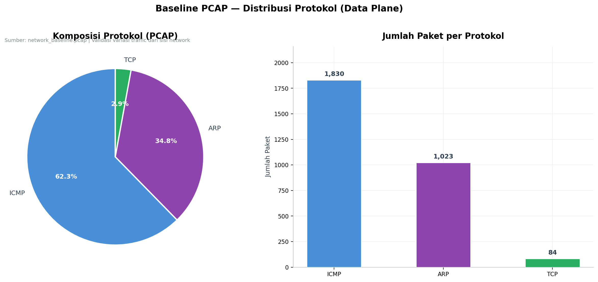
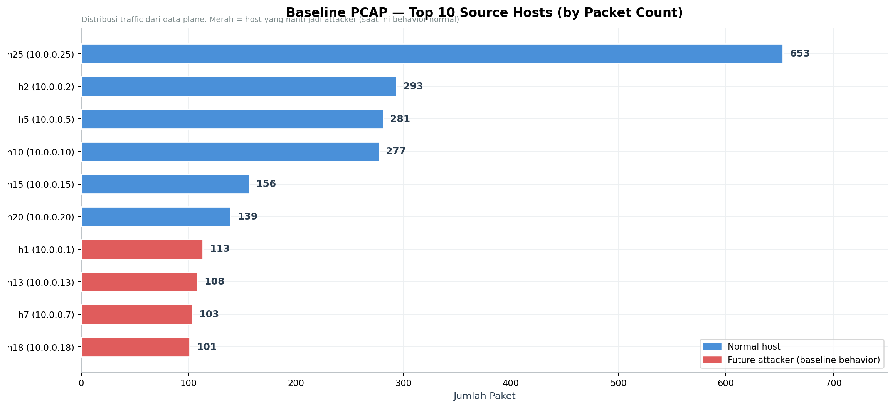
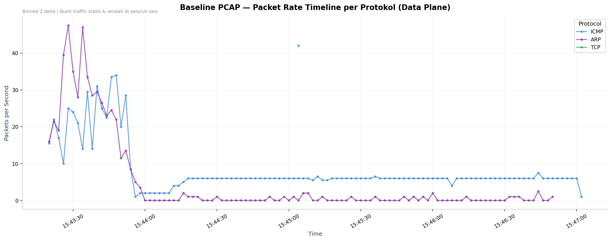
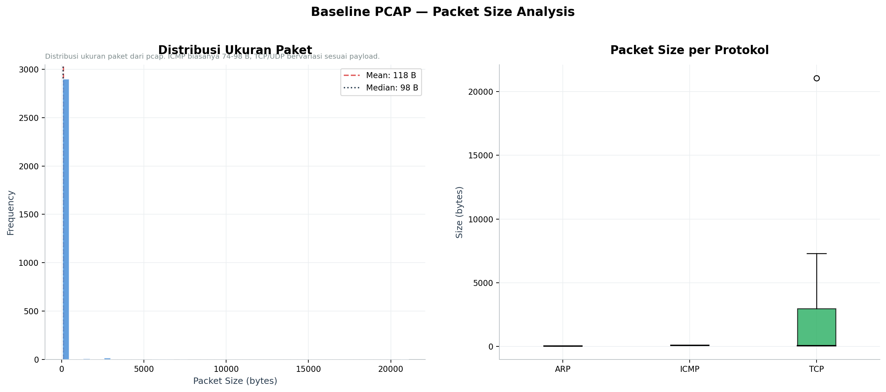

# Baseline PCAP — Forensic Analysis Report

**Generated:** 2026-06-01 20:32:07
**Data source:** `logs/archive/baseline/network_baseline.pcap`
**Plane:** Data plane (raw packets, post-merge & dedup)

---

## 1. PCAP Metadata

| Item | Value |
|------|-------|
| File size | 0.31 MB |
| Total packets | 2,937 |
| Total bytes | 345,162 |
| Duration | 222.06 seconds |
| Start time | 2026-05-31 15:43:20 |
| End time | 2026-05-31 15:47:02 |
| Average rate | 13.23 pps |
| Average packet size | 117.5 bytes |
| Unique source IPs | 25 |
| Unique destination IPs | 25 |

---

## 2. Protocol Distribution (Data Plane)

PCAP menunjukkan variasi protokol yang konsisten dengan baseline scenario yang dirancang (ping, TCP transfer, UDP transfer, HTTP, ARP discovery).

| Protocol | Packets | Percentage |
|----------|---------|------------|
| ICMP | 1,830 | 62.3% |
| ARP | 1,023 | 34.8% |
| TCP | 84 | 2.9% |

---

## 3. Per-Host Traffic Analysis

Top 10 source host paling aktif:

| Source | Packets | Status |
|--------|---------|--------|
| `10.0.0.25` (h25) | 653 | ✅ normal |
| `10.0.0.2` (h2) | 293 | ✅ normal |
| `10.0.0.5` (h5) | 281 | ✅ normal |
| `10.0.0.10` (h10) | 277 | ✅ normal |
| `10.0.0.15` (h15) | 156 | ✅ normal |
| `10.0.0.20` (h20) | 139 | ✅ normal |
| `10.0.0.1` (h1) | 113 | ⚠️ future attacker |
| `10.0.0.13` (h13) | 108 | ⚠️ future attacker |
| `10.0.0.7` (h7) | 103 | ⚠️ future attacker |
| `10.0.0.18` (h18) | 101 | ⚠️ future attacker |

> **Bukti behavior normal**: Host yang nanti jadi attacker (`h1`, `h7`, `h13`, `h18`) di baseline ini menunjukkan paket count **proporsional** dengan host normal — tidak ada dominasi yang mencurigakan.

---

## 4. Rate Timeline (Data Plane)

Packet rate stabil di kisaran rendah sepanjang sesi capture. Tidak ada spike yang mengindikasikan flood attempt.

---

## 5. Packet Size Analysis

Distribusi ukuran paket konsisten dengan traffic mix normal:
- **ICMP**: biasanya 74-98 bytes (echo request/reply standar)
- **TCP**: bervariasi (handshake kecil + data payload sesuai transfer)
- **UDP**: bervariasi sesuai payload
- **ARP**: 42 bytes (fixed size)

Rata-rata ukuran paket: **117.5 bytes** (Median: **98 bytes**).

---

## 6. Forensic Findings

1. **Network baseline terbukti sehat dari sisi data plane** — 2,937 paket dengan rate stabil 13.23 pps
2. **Variasi protokol konsisten** — ICMP, ARP, TCP hadir sesuai skenario traffic mix
3. **Tidak ada flood signature** — tidak ada host yang dominan dengan rate abnormal
4. **Future attackers berperilaku normal** — h1, h7, h13, h18 paket count sebanding dengan normal hosts
5. **Validasi cross-plane** — PCAP (data plane) konsisten dengan CSV controller (control plane)

---

## 7. Validasi Cross-Plane

| Klaim | Bukti CSV (control plane) | Bukti PCAP (data plane) |
|-------|---------------------------|-------------------------|
| Network sehat | 100% NORMAL state | Rate 13.23 pps, no flood |
| Variasi traffic | Multi-protocol di CSV | 3 protokol di PCAP |
| No false positive | 0 WARNING/ATTACK | No abnormal rate spike |

---

*Report ini di-generate otomatis dari `analyze_pcap_baseline.py`. Untuk analisis DDoS PCAP, lihat `ddos_pcap_summary.md`.*
