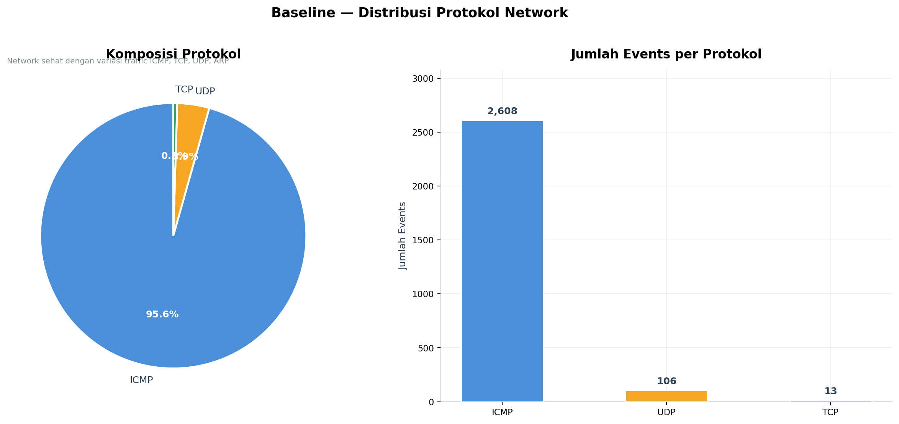
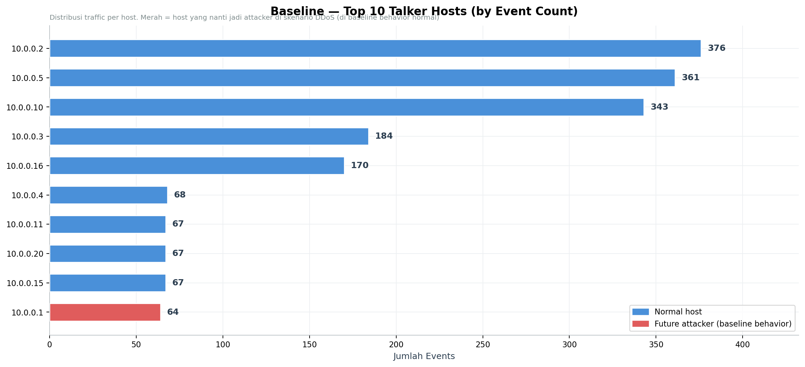
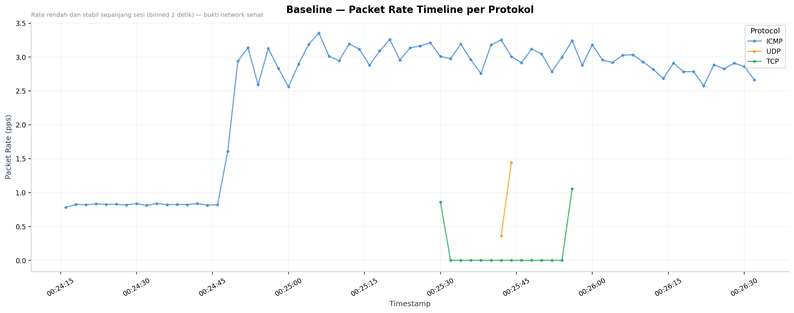
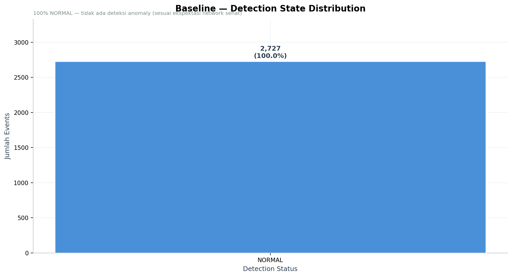

# Baseline Scenario — Analysis Report

**Generated:** 2026-05-21 15:27:44
**Data source:** `logs/archive/baseline/traffic_analysis.csv`

---

## 1. Experiment Context

| Item | Value |
|------|-------|
| Duration | 136.73 seconds |
| Start time | 2026-05-21 00:24:17 |
| End time | 2026-05-21 00:26:33 |
| Total events | 2,727 |
| Unique source hosts | 25 |
| Unique destination hosts | 25 |
| Average packet rate | 1.63 pps |
| Max packet rate | 8.71 pps |

---

## 2. Network Health Status

**Status:** 🟢 **CLEAN** — Network sehat, tidak ada deteksi anomaly

| Detection State | Events |
|----------------|--------|
| NORMAL | 2,727 |
| WARNING | 0 |
| ATTACK_CONFIRMED | 0 |
| DROP_ACTIVE | 0 |

---

## 3. Protocol Distribution

Network baseline menunjukkan **variasi protokol yang sehat** sesuai aktivitas enterprise normal (ping, TCP transfer, UDP transfer, HTTP request, ARP discovery).

| Protocol | Events | Percentage |
|----------|--------|------------|
| ICMP | 2,608 | 95.6% |
| UDP | 106 | 3.9% |
| TCP | 13 | 0.5% |

---

## 4. Top Talker Hosts

5 host paling aktif sebagai source traffic:

| Host IP | Event Count | Status |
|---------|-------------|--------|
| `10.0.0.2` | 376 | ✅ normal |
| `10.0.0.5` | 361 | ✅ normal |
| `10.0.0.10` | 343 | ✅ normal |
| `10.0.0.3` | 184 | ✅ normal |
| `10.0.0.16` | 170 | ✅ normal |

> Host yang menjadi attacker di skenario DDoS (h1, h7, h13, h18) di baseline ini menunjukkan **behavior normal** — terlibat di traffic ping standar saat `pingall`, tidak ada anomaly.

---

## 5. Packet Rate Over Time

Packet rate stabil dan rendah sepanjang sesi capture, dengan rata-rata **1.63 pps** dan maksimum **8.71 pps**. Tidak ada spike yang mengindikasikan flood.

---

## 6. Detection State Verification

Controller berhasil mengklasifikasikan **100.0%** traffic sebagai NORMAL, yang berarti detection engine bekerja dengan benar (no false positives di kondisi sehat).

---

## 7. Key Findings

1. **Network terbukti sehat** — semua 2,727 events terklasifikasi NORMAL
2. **Variasi protokol tercatat** — ICMP, UDP, TCP berfungsi normal
3. **Tidak ada false positive** — controller tidak men-trigger WARNING/ATTACK pada traffic legitimate
4. **Distribusi host merata** — tidak ada single host yang dominan secara abnormal
5. **Packet rate rendah** — average 1.63 pps, jauh di bawah threshold WARNING (20 pps) dan ATTACK (50 pps)

---

*Report ini di-generate otomatis dari `analyze_baseline.py`. Untuk skenario DDoS, lihat `ddos_summary.md`. Untuk perbandingan komprehensif, lihat `combined_report.md`.*
