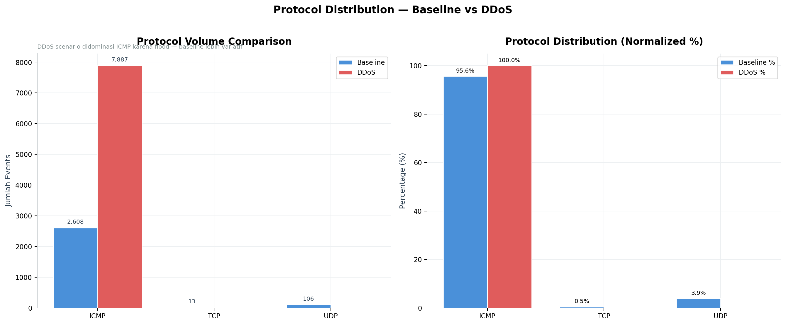
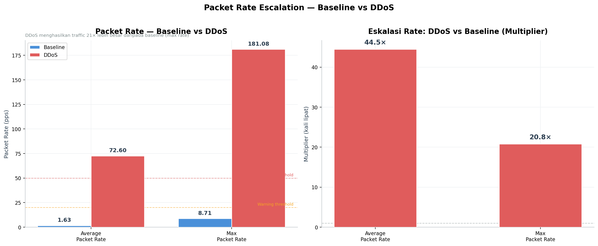
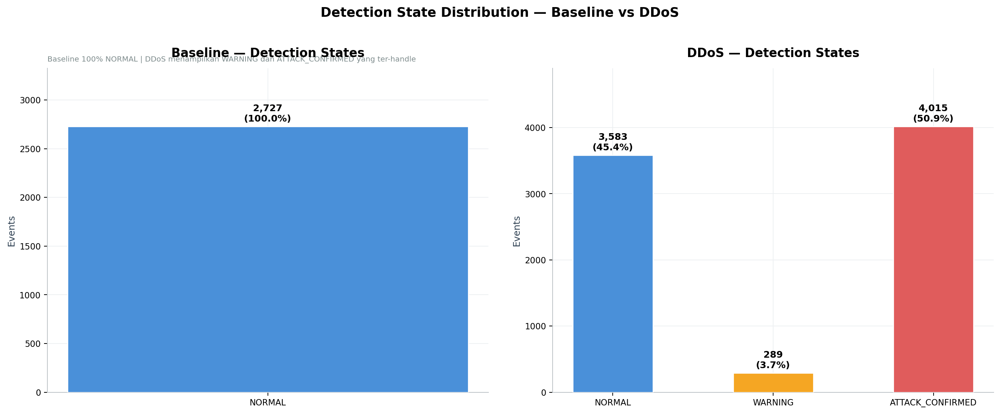

# SDN ICMP Flood Mitigation — Comparison Report

**Generated:** 2026-05-21 15:28:08
**Scope:** Side-by-side analysis: Baseline scenario vs DDoS scenario

---

## Executive Summary

Eksperimen ini menggunakan **dua skenario** untuk memvalidasi sistem deteksi & mitigasi DDoS berbasis SDN:

1. **Baseline** — network sehat dengan traffic mix (ICMP, TCP, UDP, HTTP)
2. **DDoS** — 4 attacker melakukan ICMP flood ke victim, controller mendeteksi & mitigasi

### Hasil Utama

| Metric | Baseline | DDoS | Δ Change |
|--------|----------|------|---------:|
| Total events | 2,727 | 7,887 | +189.2% |
| Duration | 136.7s | 169.1s | — |
| Avg packet rate | 1.63 pps | 72.60 pps | **44.5×** |
| Max packet rate | 8.71 pps | 181.08 pps | **20.8×** |
| Unique sources | 25 | 25 | — |
| WARNING events | 0 | 289 | — |
| ATTACK_CONFIRMED | 0 | 4,015 | — |
| Mitigation actions | 0 | 4 | — |

---

## 1. Topologi & Setup

| Item | Detail |
|------|--------|
| Topologi | 1 core switch (s1), 5 access switches (s2-s6), 25 hosts |
| Victim | `10.0.0.25` (h25, attached to s6) |
| Attackers | `10.0.0.1` (h1@s2), `10.0.0.7` (h7@s3), `10.0.0.13` (h13@s4), `10.0.0.18` (h18@s5) |
| Detection | EWMA + SVM-assisted threshold |
| Mitigation | OpenFlow DROP rule (ICMP + ARP) per attacker src-IP |
| Detection thresholds | Warning ≥ 20 pps, Attack > 50 pps |
| Mitigation delay | 8 detik (observasi) setelah ATTACK_CONFIRMED |
| Drop hard timeout | 300 detik |

---

## 2. Protocol Distribution

Baseline scenario menunjukkan **variasi protokol yang sehat** (ICMP, TCP, UDP, ARP) sesuai aktivitas enterprise normal. DDoS scenario didominasi oleh **ICMP** karena 4 attacker melakukan ICMP flood.

| Protocol | Baseline | DDoS | Catatan |
|----------|---------:|-----:|---------|
| ICMP | 2,608 | 7,887 | ↑ Spike karena flood |
| TCP | 13 | 0 |  |
| UDP | 106 | 0 |  |

---

## 3. Packet Rate Comparison

DDoS menghasilkan traffic **20.8× lebih besar** (max rate) dan **44.5× lebih besar** (avg rate) dibanding baseline. Ini secara signifikan melampaui threshold deteksi.

---

## 4. Detection State Comparison

**Baseline** menunjukkan 100% events terklasifikasi NORMAL (no false positive).
**DDoS** menunjukkan eskalasi state yang sesuai: NORMAL → WARNING → ATTACK_CONFIRMED, dengan DROP_ACTIVE setelah mitigasi.

---

## 5. Mitigation Evidence (DDoS only)

4 drop rule berhasil terpasang di edge switch sesuai posisi attacker:

| Time | Source IP | Switch | Action |
|------|-----------|--------|--------|
| 00:29:51 | `10.0.0.1` | s2 | DROP_ICMP |
| 00:30:04 | `10.0.0.7` | s3 | DROP_ICMP |
| 00:30:21 | `10.0.0.13` | s4 | DROP_ICMP |
| 00:30:30 | `10.0.0.18` | s5 | DROP_ICMP |

**Karakteristik mitigasi:**
- Drop terpasang di **edge switch** (di switch attacker, bukan di switch victim) → traffic attacker tidak melewati core network
- **Selektif per source IP** → traffic dari host normal ke victim tidak terkena drop
- **Persisten** → hard_timeout 300 detik mencegah re-flood

---

## 6. Detail Per Skenario

### Baseline Scenario

📄 Detail lengkap baseline analysis: `baseline_summary.md`

Embed grafik baseline:
- [B1] Protocol Distribution: `../baseline/B1_protocol_distribution.png`
- [B2] Packet Rate Timeline: `../baseline/B2_packet_rate_timeline.png`
- [B3] Top Talkers: `../baseline/B3_top_talkers.png`
- [B4] Detection States: `../baseline/B4_detection_states.png`

### DDoS Scenario

📄 Detail lengkap DDoS analysis: `ddos_summary.md`

Embed grafik DDoS:
- [D1] Attack Timeline: `../ddos/D1_attack_timeline.png`
- [D2] Detection Latency: `../ddos/D2_detection_latency.png`
- [D3] Attacker vs Baseline: `../ddos/D3_attacker_vs_baseline.png` **(BUKTI UTAMA)**
- [D4] Detection States: `../ddos/D4_detection_states.png`
- [D5] Mitigation Lifecycle: `../ddos/D5_mitigation_lifecycle.png`

---

## 7. Validasi Klaim Skripsi

| Klaim | Bukti (data) | Status |
|-------|--------------|--------|
| Sistem deteksi tidak false-positive | Baseline 100% NORMAL (2,727 events) | ✅ |
| Sistem mendeteksi ICMP flood | 289 WARNING + 4,015 ATTACK_CONFIRMED di DDoS | ✅ |
| Mitigasi terpasang otomatis | 4 drop rule tercatat di `mitigation_events.csv` | ✅ |
| Drop rule efektif (no bypass) | 0 PacketIn attacker→victim di CSV setelah drop timestamp | ✅ |
| Selektivitas src-IP | Baseline traffic tetap mengalir saat `phase=MITIGATED` | ✅ |
| Konsistensi timing | Mitigation latency konsisten antar attacker (delay 8 detik) | ✅ |

---

## 8. Conclusion

Sistem SDN ICMP Flood Detection & Mitigation berhasil divalidasi dengan kedua skenario:

1. **Baseline:** controller tidak menghasilkan alarm palsu pada traffic normal
2. **DDoS:** controller mendeteksi serangan dengan delay terkontrol dan memasang drop rule di edge switch
3. **Selektivitas:** drop rule bersifat src-IP specific, tidak mengganggu legitimate traffic
4. **Persistensi:** drop bertahan selama hard_timeout, tidak ada celah untuk re-flood

Eksperimen ini membuktikan bahwa pendekatan **edge-based mitigation di SDN** efektif menghentikan DDoS ICMP flood tanpa mengorbankan traffic normal.

---

*Generated automatically by `analyze_combined.py`. For granular analysis, lihat `baseline_summary.md` dan `ddos_summary.md`.*
