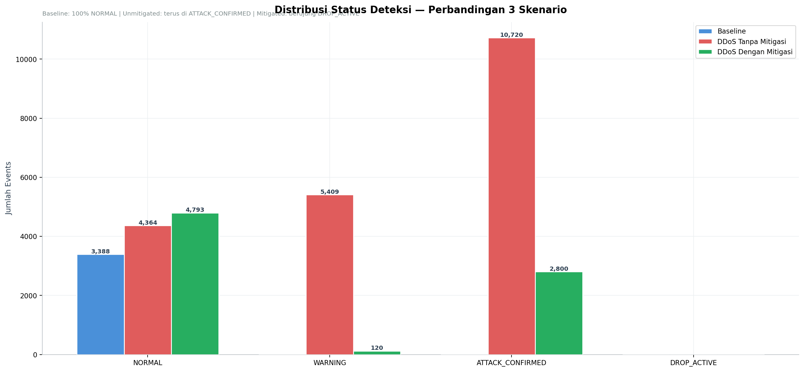
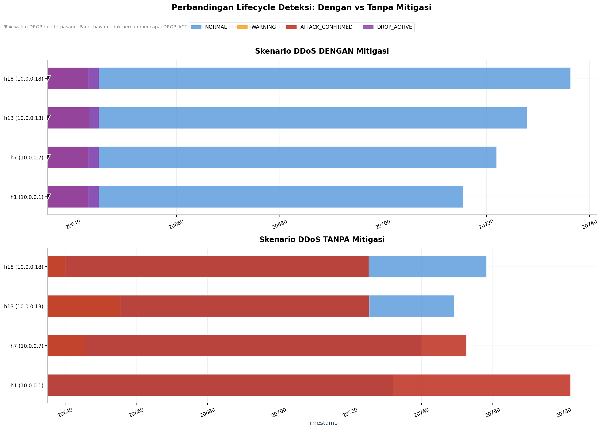
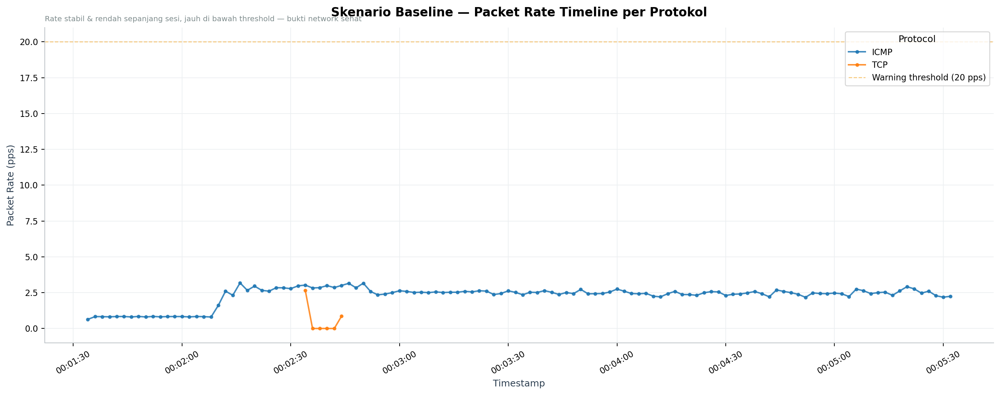
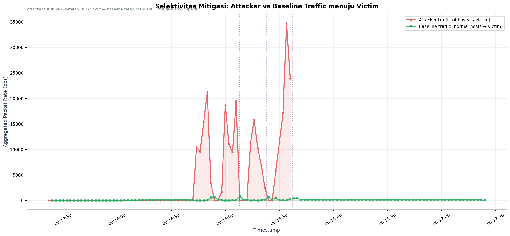
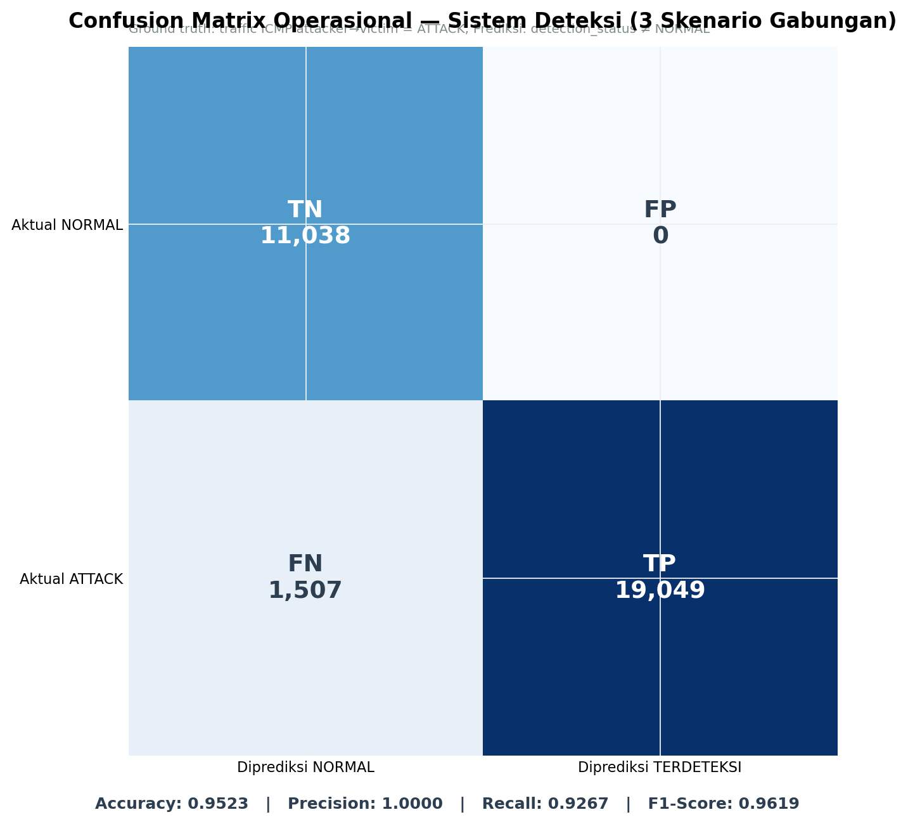

# CSV Forensic Analysis — 3 Skenario

**Generated:** 2026-07-01 00:58:56
**Data source:** `traffic_analysis.csv` + `mitigation_events.csv` (baseline, ddos_unmitigated, ddos)

---

## 1. Ringkasan Eksperimen

| Skenario | Total Events | Durasi | Avg Rate | Max Rate |
|----------|-------------:|-------:|---------:|---------:|
| Baseline | 3,388 | 237.5s | 1.74 pps | 6.76 pps |
| DDoS Tanpa Mitigasi | 20,493 | 246.8s | 44.37 pps | 223.68 pps |
| DDoS Dengan Mitigasi | 7,713 | 243.7s | 35.53 pps | 148.26 pps |

---

## 2. Distribusi Status Deteksi

| Status | Baseline | DDoS Tanpa Mitigasi | DDoS Dengan Mitigasi |
|--------|---:|---:|---:|
| NORMAL | 3,388 | 4,364 | 4,793 |
| WARNING | 0 | 5,409 | 120 |
| ATTACK_CONFIRMED | 0 | 10,720 | 2,800 |
| DROP_ACTIVE | 0 | 0 | 0 |

---

## 3. Lifecycle Deteksi & Mitigasi

Pada skenario tanpa mitigasi, seluruh attacker bertahan di status ATTACK_CONFIRMED
hingga akhir sesi observasi — tidak pernah mencapai DROP_ACTIVE. Pada skenario
dengan mitigasi, keempat attacker berhasil mencapai DROP_ACTIVE secara bertahap.

---

## 4. Mitigation Events (Skenario Mitigated)

| Time | Source IP | Switch | Action |
|------|-----------|--------|--------|
| 00:14:52 | `10.0.0.1` | s2 | DROP_ICMP |
| 00:15:07 | `10.0.0.7` | s3 | DROP_ICMP |
| 00:15:22 | `10.0.0.13` | s4 | DROP_ICMP |
| 00:15:37 | `10.0.0.18` | s5 | DROP_ICMP |

## 4. Confusion Matrix Operasional

Dihitung dari gabungan event ketiga skenario, membandingkan ground truth
(traffic ICMP attacker→victim = ATTACK) dengan prediksi sistem
(`detection_status` ≠ NORMAL = terdeteksi).

| | Diprediksi NORMAL | Diprediksi TERDETEKSI |
|---|---:|---:|
| **Aktual NORMAL** | TN = 11,038 | FP = 0 |
| **Aktual ATTACK** | FN = 1,507 | TP = 19,049 |

- Accuracy: **0.9523**
- Precision: **1.0000**
- Recall: **0.9267**
- F1-Score: **0.9619**

---

*Di-generate otomatis oleh `analyze_csv.py`. Untuk analisis PCAP, lihat `pcap_summary.md`.*
