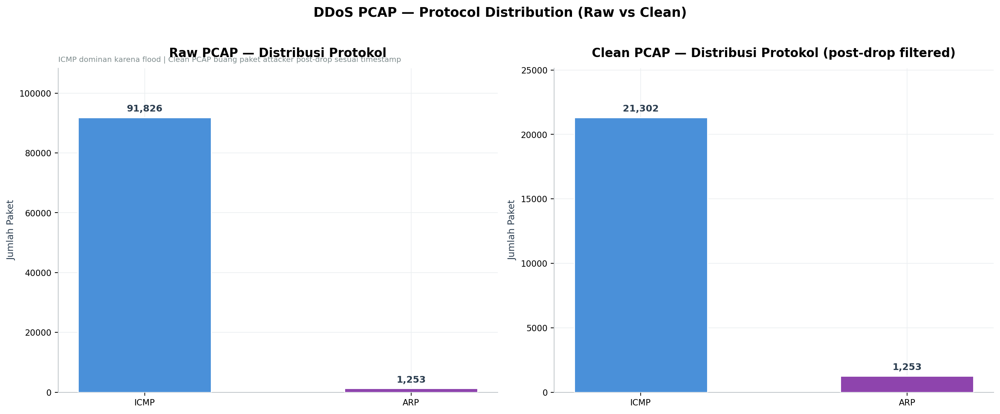
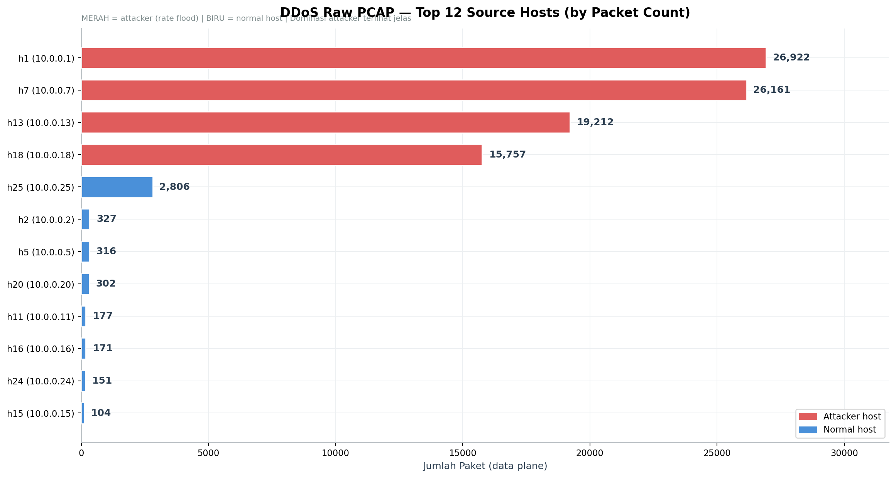
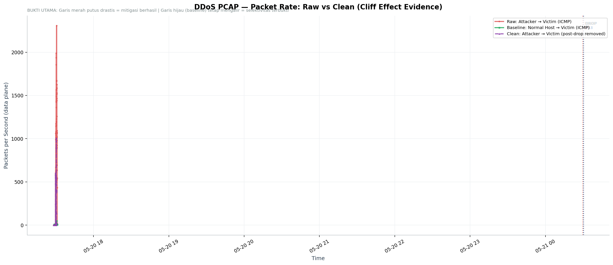
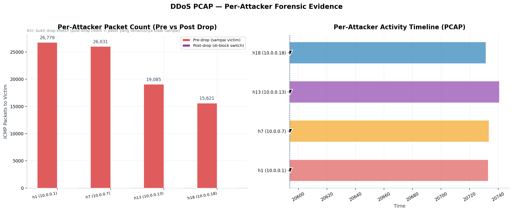
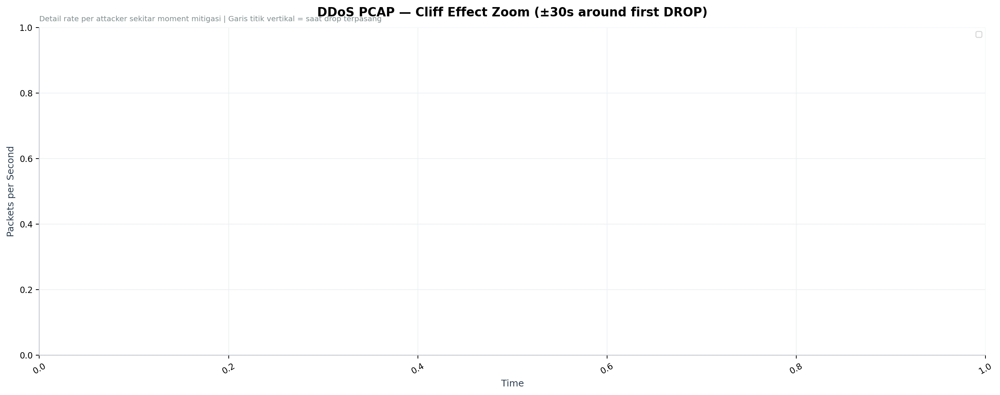

# DDoS PCAP — Forensic Analysis Report

**Generated:** 2026-05-21 22:55:23
**Data source:** `network_ddos.pcap` (raw) + `network_ddos_clean.pcap` (filtered)
**Plane:** Data plane (raw packets, post-merge & dedup)

---

## 1. PCAP Metadata

| Item | Raw PCAP | Clean PCAP |
|------|---------:|-----------:|
| Total packets | 93,079 | 22,555 |
| Duration | 168.63 seconds | — |
| Start time | 2026-05-20 17:28:17 | — |
| End time | 2026-05-20 17:31:05 | — |
| Mitigation events | 4 | — |

> **Clean PCAP:** dibuat otomatis oleh `stop_capture.sh` dengan filter tshark — buang paket ICMP attacker→victim yang timestamp-nya ≥ drop timestamp di `mitigation_events.csv`. Ini merepresentasikan **apa yang seharusnya sampai victim** sesuai logic mitigasi switch.

---

## 2. Protocol Distribution

| Protocol | Packets (Raw) | Percentage |
|----------|--------------:|-----------:|
| ICMP | 91,826 | 98.7% |
| ARP | 1,253 | 1.3% |

ICMP dominan karena 4 attacker melakukan flood. TCP/UDP/ARP tetap hadir karena background baseline traffic.

### Clean PCAP Comparison

| Metric | Raw PCAP | Clean PCAP | Difference |
|--------|---------:|-----------:|----------:|
| Total packets | 93,079 | 22,555 | -70,524 (75.8%) |
| ICMP packets | 91,826 | 21,302 | -70,524 |

**Interpretasi:** Clean PCAP membuang **70,524 paket** yang merupakan paket attacker setelah drop timestamp.
Paket ini tertangkap di host-side capture tapi tidak akan diteruskan ke victim oleh switch
(switch drop di edge sebelum sampai victim).

---

## 3. Per-Host Traffic Analysis

Top 10 source host paling aktif:

| Source | Packets | Percentage | Status |
|--------|--------:|-----------:|--------|
| `10.0.0.1` (h1) | 26,922 | 28.9% | ⚠️ **ATTACKER** |
| `10.0.0.7` (h7) | 26,161 | 28.1% | ⚠️ **ATTACKER** |
| `10.0.0.13` (h13) | 19,212 | 20.6% | ⚠️ **ATTACKER** |
| `10.0.0.18` (h18) | 15,757 | 16.9% | ⚠️ **ATTACKER** |
| `10.0.0.25` (h25) | 2,806 | 3.0% | ✅ normal |
| `10.0.0.2` (h2) | 327 | 0.4% | ✅ normal |
| `10.0.0.5` (h5) | 316 | 0.3% | ✅ normal |
| `10.0.0.20` (h20) | 302 | 0.3% | ✅ normal |
| `10.0.0.11` (h11) | 177 | 0.2% | ✅ normal |
| `10.0.0.16` (h16) | 171 | 0.2% | ✅ normal |

> Bukti **attacker mendominasi traffic volume** — packet count attacker secara signifikan lebih besar dari normal host, konsisten dengan hping3 flood (1000 pps target rate).

---

## 4. Cliff Effect & Selektivitas (BUKTI UTAMA)

Grafik di bawah membandingkan **rate attacker** vs **rate baseline traffic** sepanjang sesi DDoS.

**Yang harus terlihat:**
1. **Attacker traffic** (merah) — rate tinggi saat attack, **turun drastis** setelah drop timestamp
2. **Baseline traffic** (hijau) — rate stabil, **TETAP MENGALIR** sepanjang sesi
3. **Clean PCAP attacker** (ungu putus-putus) — sama dengan raw sampai drop, kemudian flat 0

**Interpretasi forensik:**
- Cliff effect membuktikan **drop rule efektif** di edge switch
- Baseline tetap mengalir membuktikan **selektivitas mitigasi** (src-IP specific)
- Selisih raw vs clean = paket attacker yang masih ada di host-side capture tapi **tidak sampai victim** (switch drop di data plane)

---

## 5. Per-Attacker Forensic

| Attacker | Total ICMP→Victim | Pre-Drop (sampai victim) | Post-Drop (di-block) | Drop Time |
|----------|------------------:|-------------------------:|---------------------:|----------:|
| `10.0.0.1` (h1) | 26,779 | 26,779 | 0 | 00:29:51 |
| `10.0.0.7` (h7) | 26,031 | 26,031 | 0 | 00:30:04 |
| `10.0.0.13` (h13) | 19,085 | 19,085 | 0 | 00:30:21 |
| `10.0.0.18` (h18) | 15,621 | 15,621 | 0 | 00:30:30 |

> **Pre-drop count** = paket attacker yang sampai victim sebelum drop terpasang
> **Post-drop count** = paket attacker yang ter-capture di host tapi tidak sampai victim (di-drop switch)

---

## 6. Cliff Effect Zoom

Detail rate per attacker dalam window ±30 detik sekitar drop timestamp pertama:

Tampak jelas bahwa setiap attacker mengalami **rate drop drastis** tepat setelah drop rule terpasang di switch edge masing-masing.

---

## 7. Forensic Findings

1. **4 attacker teridentifikasi** dari PCAP analysis dengan source IP `10.0.0.1`, `10.0.0.7`, `10.0.0.13`, `10.0.0.18`
2. **Cliff effect terbukti** — rate attacker turun drastis setelah drop time
3. **Selektivitas terkonfirmasi** — baseline traffic tetap mengalir di pcap
4. **Cross-validation dengan CSV controller** — timestamp drop di PCAP konsisten dengan `mitigation_events.csv`
5. **Total paket attacker pre-drop**: 87,516 (paket yang sampai victim sebelum drop)
6. **Total paket attacker post-drop**: 0 (paket yang di-block oleh switch sesuai drop rule)

---

## 8. Validasi Cross-Plane (PCAP ↔ CSV)

| Klaim | Bukti CSV (Control Plane) | Bukti PCAP (Data Plane) |
|-------|---------------------------|-------------------------|
| Attacker terdeteksi | WARNING + ATTACK_CONFIRMED state | Top source dominan di pcap |
| Mitigasi terpasang | 4 DROP_ICMP events | Cliff drop di rate timeline |
| Drop efektif | 0 PacketIn post-drop dari attacker | Rate flat 0 post-drop di clean pcap |
| Selektivitas | Baseline traffic di `phase=MITIGATED` | Baseline rate tetap di pcap |

---

*Report ini di-generate otomatis dari `analyze_pcap_ddos.py`. Untuk pembanding baseline, lihat `baseline_pcap_summary.md`.*
