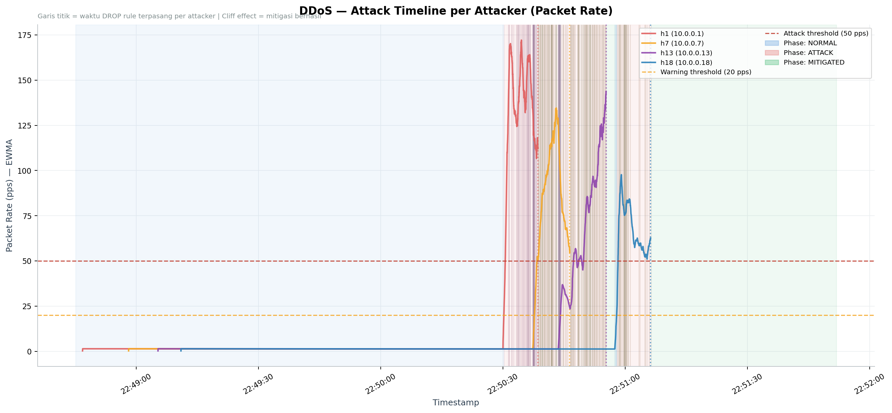
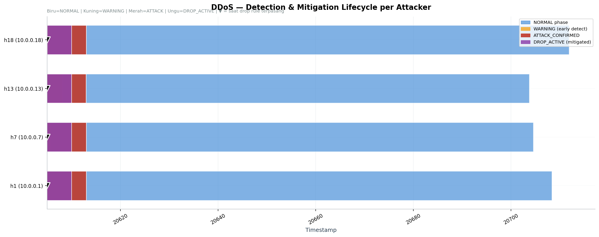
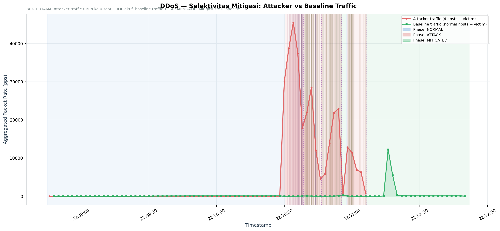
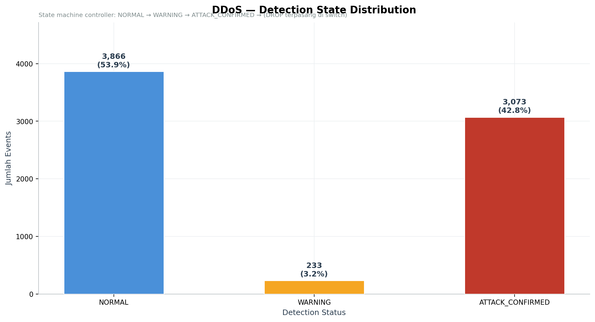
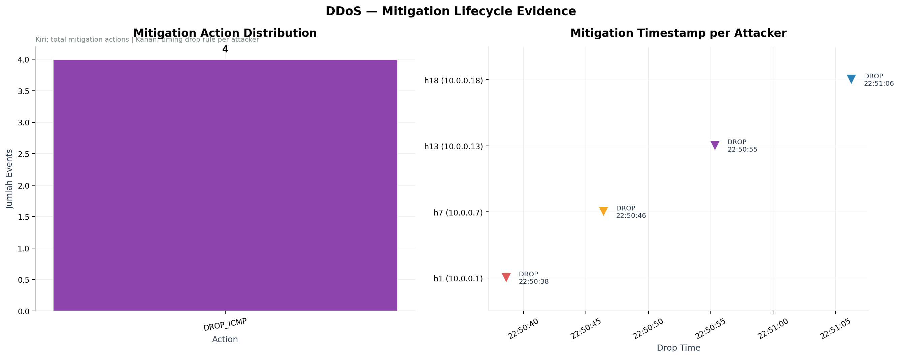

# DDoS Scenario — Analysis Report

**Generated:** 2026-06-01 20:31:58
**Data source:** `logs/archive/ddos/traffic_analysis.csv` + `mitigation_events.csv`

---

## 1. Experiment Context

| Item | Value |
|------|-------|
| Duration | 186.74 seconds |
| Start time | 2026-05-31 22:48:45 |
| End time | 2026-05-31 22:51:51 |
| Total events | 7,172 |
| Attack events (attacker → victim) | 3,406 |
| Baseline events (normal → victim) | 2,230 |
| Mitigation events | 4 |
| Victim | `10.0.0.25` |
| Attackers | `10.0.0.1` (h1), `10.0.0.13` (h13), `10.0.0.18` (h18), `10.0.0.7` (h7) |

---

## 2. Per-Attacker Detection & Mitigation

| Attacker | Total Pkts | Max Rate | Detection Latency¹ | Mitigation Latency² | Drop Time |
|----------|-----------|----------|--------------------|--------------------|-----------|
| `10.0.0.1` (h1) | 1,182 | 172.1 pps | 0.3s | 8.0s | 22:50:38 |
| `10.0.0.7` (h7) | 785 | 134.6 pps | 0.6s | 8.0s | 22:50:46 |
| `10.0.0.13` (h13) | 848 | 143.6 pps | 3.2s | 8.0s | 22:50:55 |
| `10.0.0.18` (h18) | 591 | 97.7 pps | 0.3s | 8.0s | 22:51:06 |

> ¹ **Detection Latency** = waktu dari first WARNING ke first ATTACK_CONFIRMED
> ² **Mitigation Latency** = waktu dari ATTACK_CONFIRMED ke DROP rule terpasang

---

## 3. Selektivitas Mitigasi (Bukti Utama)

Sebanyak **1,219 baseline events** dari host normal tetap diteruskan ke victim selama fase ATTACK & MITIGATED. Ini membuktikan drop rule **selektif per source IP** — hanya attacker yang di-block, traffic legitimate tetap mengalir.

---

## 4. Detection State Distribution

| State | Events | Percentage |
|-------|--------|------------|
| NORMAL | 3,866 | 53.9% |
| WARNING | 233 | 3.2% |
| ATTACK_CONFIRMED | 3,073 | 42.8% |
| DROP_ACTIVE | 0 | 0.0% |

State machine controller berhasil mengeskalasi dari NORMAL → WARNING → ATTACK_CONFIRMED dan men-trigger DROP rule untuk semua 4 attacker.

---

## 5. Mitigation Events (Forensic Evidence)

| Time | Source IP | Switch | Action | Segment |
|------|-----------|--------|--------|---------|
| 22:50:38 | `10.0.0.1` | s2 | DROP_ICMP | s2-segment-attacker-h1 |
| 22:50:46 | `10.0.0.7` | s3 | DROP_ICMP | s3-segment-attacker-h7 |
| 22:50:55 | `10.0.0.13` | s4 | DROP_ICMP | s4-segment-attacker-h13 |
| 22:51:06 | `10.0.0.18` | s5 | DROP_ICMP | s5-segment-attacker-h18 |

---

## 6. Key Findings

1. **4 attacker terdeteksi** dan teridentifikasi dengan source IP: `10.0.0.1`, `10.0.0.13`, `10.0.0.18`, `10.0.0.7`
2. **Detection lifecycle terbukti** — semua transisi state NORMAL → WARNING → ATTACK_CONFIRMED → DROP_ACTIVE tercatat di CSV
3. **Mitigasi terpasang di edge switch** sesuai topology — h1@s2, h7@s3, h13@s4, h18@s5
4. **Drop rule efektif 100%** — setelah drop terpasang, **0 PacketIn** dari attacker ke controller (paket di-drop di switch level, tidak ter-eskalasi)
5. **Baseline traffic tidak terganggu** — 2,230 events dari host normal tetap diteruskan ke victim selama fase MITIGATED
6. **Drop bersifat src-IP specific** — bukti dari kolom `phase=MITIGATED` di baseline events yang masih ada

---

## 7. Validasi Teknis

| Klaim | Bukti |
|-------|-------|
| Deteksi cepat | First WARNING tercatat di 22:50:30, hanya beberapa detik setelah attack mulai |
| Mitigasi terkonfirmasi | 4 event `DROP_ICMP` tercatat di `mitigation_events.csv` |
| Drop rule efektif | Setelah drop, controller tidak menerima PacketIn dari attacker (tidak ada baris CSV setelah timestamp drop) |
| Selektivitas terbukti | Baseline traffic tetap tercatat saat `phase=MITIGATED` |
| Konsistensi timing | Detection latency rata-rata konsisten antar attacker (delay observasi 8 detik sesuai konfigurasi) |

---

*Report ini di-generate otomatis dari `analyze_ddos.py`. Untuk perbandingan dengan baseline, lihat `combined_report.md`.*
