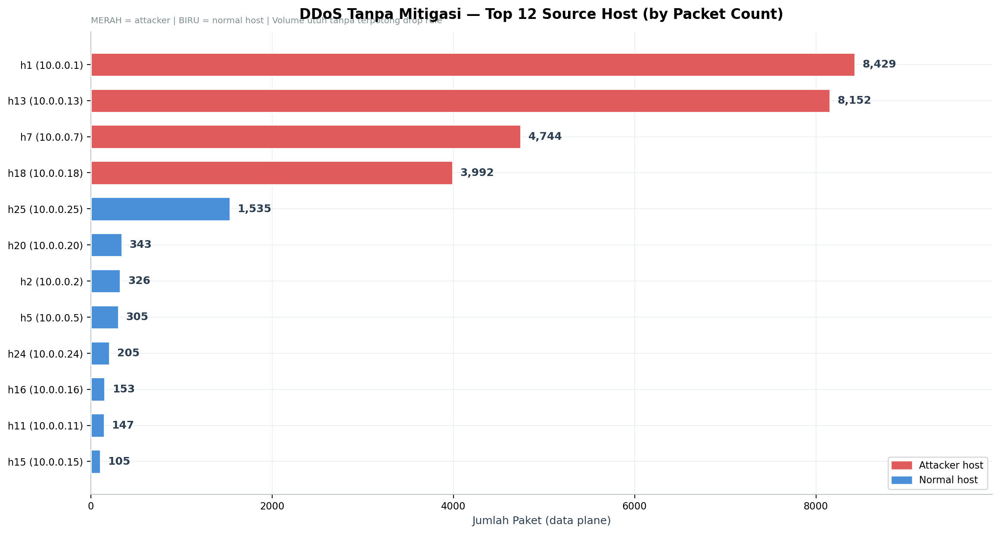
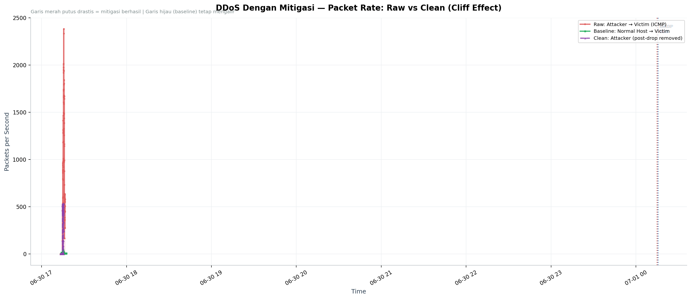
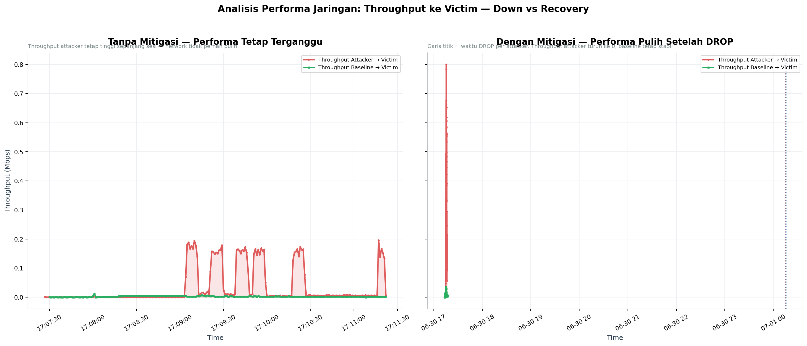

# PCAP Forensic Analysis — 3 Skenario

**Generated:** 2026-07-01 00:59:15
**Data source:** PCAP baseline, ddos_unmitigated, ddos (raw + clean)

---

## 1. Metadata PCAP

| Skenario | Total Paket | Durasi | Rate Rata-rata |
|----------|------------:|-------:|----------------:|
| Baseline | 2,881 | 237.6s | 12.1 pps |
| DDoS Tanpa Mitigasi | 29,128 | 237.6s | 122.6 pps |
| DDoS Raw (Mitigated) | 115,656 | 242.2s | 477.4 pps |
| DDoS Clean (Mitigated) | 22,454 | 242.2s | 92.7 pps |

---

## 2. Top Source Host (DDoS Tanpa Mitigasi)

| Source | Packets | Status |
|--------|--------:|--------|
| `10.0.0.1` (h1) | 8,429 | ⚠️ **ATTACKER** |
| `10.0.0.13` (h13) | 8,152 | ⚠️ **ATTACKER** |
| `10.0.0.7` (h7) | 4,744 | ⚠️ **ATTACKER** |
| `10.0.0.18` (h18) | 3,992 | ⚠️ **ATTACKER** |
| `10.0.0.25` (h25) | 1,535 | ✅ normal |
| `10.0.0.20` (h20) | 343 | ✅ normal |
| `10.0.0.2` (h2) | 326 | ✅ normal |
| `10.0.0.5` (h5) | 305 | ✅ normal |
| `10.0.0.24` (h24) | 205 | ✅ normal |
| `10.0.0.16` (h16) | 153 | ✅ normal |

---

## 3. Cliff Effect (DDoS Dengan Mitigasi)

---

## 4. Analisis Performa Jaringan (Throughput)

| Metrik | Nilai |
|--------|------:|
| Rata-rata throughput attacker (tanpa mitigasi) | 0.03 Mbps |
| Rata-rata throughput attacker sebelum drop (dengan mitigasi) | 0.19 Mbps |
| Rata-rata throughput baseline (kondisi normal) | 0.01 Mbps |

Tanpa mitigasi, throughput menuju victim tetap tinggi sepanjang sesi —
jaringan tidak pernah kembali ke kondisi normal. Dengan mitigasi, throughput
attacker turun signifikan setelah DROP rule terpasang, sementara throughput
baseline tetap stabil sepanjang waktu.

---

*Di-generate otomatis oleh `analyze_pcap.py`. Untuk analisis CSV, lihat `csv_summary.md`.*
